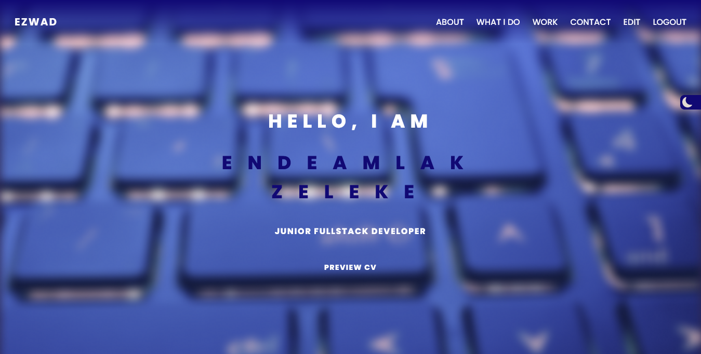

# Portfolio using react js and firebase

## Table of contents

- [Overview](#overview)
  - [Screenshot](#Screenshots)
  - [Links](#links)
- [My process](#my-process)
  - [Built with](#built-with)
  - [Useful resources](#Resources)
- [Author](#author)

## Overview

This Project is done using react js and firebase to store data. It uses tailwind css for styling. It also uses email js to exchange messages using email.

### Screenshots

### Links

- Solution Link: [Solution Link](https://github.com/Ezmad-Ze/react-tailwind-portfolio)
- Live Link: [Live Link](https://ezmad.pages.dev/)

## My process

### Built with

- [React](https://reactjs.org/) - JS library
- [Tailwind](#resources)
- [EmailJS](#resources)
- [Firebase](#resources)

### Resources

- [Tailwind Docs](https://tailwindcss.com/docs)
- [To Generate Tailwind Gradients](https://hypercolor.dev/generator)
- [Firebase Docs](https://firebase.google.com/docs)
- [Vite Docs](https://vitejs.dev/guide/)
- [EmailJS Docs](https://www.emailjs.com/docs/)

## Author

- Endeamlak Z
